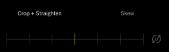
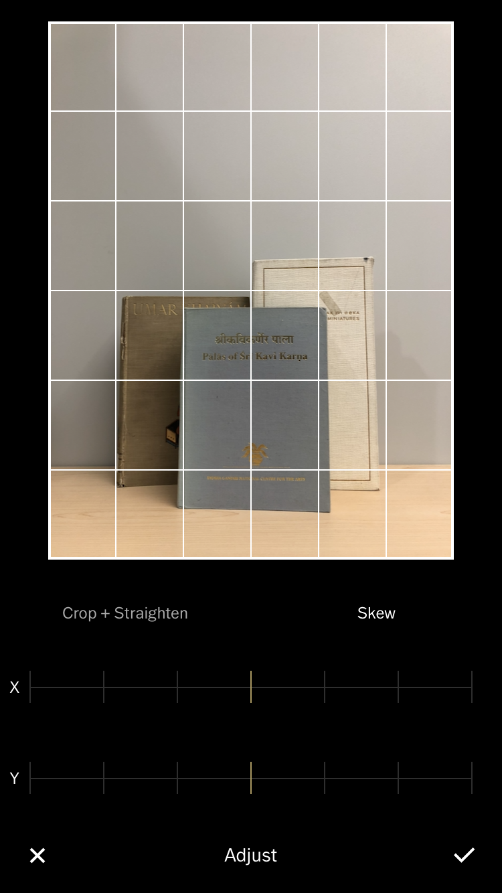

# Bonus Take Home Activity: Fixing Barrel Distortion 
Barrel distortion is mostly obvious when taking photos of objects with straight lines. This activity will guide you through the tools in VSCO to correct that distortion. If you have any questions or get stuck as you work through this in-class exercise, please ask the instructor for assistance.  
1. Take a photo of something tall with straight lines. This can be a frame, bookshelf, doorway, or building. 
2.  Open VSCO. Tap on the plus (+) sign at the top of the screen to bring up your camera roll and add your new image to VSCO. Tap to select the image and then tap Continue at the bottom of the screen. 
3.  Tap again to select the image and then tap Edit at the bottom of the screen. Tap again on the little sliders icon on the bottom. Tap on the Adjust icon.
4. Drag the slider to do any basic straightening, if needed. Tap on the word “Skew” to bring up the next controls. Drag the Y slider across to fix the distortion. Use the X slider if needed. If at this point you realize that you over-corrected when straightening in the previous mode, you can tap back on Crop + Straighten and make changes there. Remember there will be some natural leaning resulting in a lack of perfect squares, and there is generally no way to get everything perfectly square - but we can get things at least a little better.  
5. Once your objects look like they are closer to the correct proportions, tap the check mark in the bottom right corner. This will bring you back into the main editing space where you can make changes to exposure, etc. or go into Presets mode to apply a preset to your image.  
6. If you are happy with your photo, tap on Next in the upper right corner. Make sure Save to Camera Roll is active and then tap Save. 

[Bonus Take Home Activity 2: Mini Home Studio](home-studio.html){: .btn .btn-blue } 
[Bonus Take Home Activity 3: App list. More videos and Key terms](more.html){: .btn .btn-blue }
