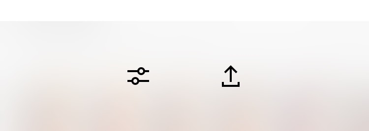

# Bonus Take Home Activity: Fixing Barrel Distortion 
Barrel distortion is mostly obvious when taking photos of objects with straight lines. This activity will guide you through the tools in VSCOcam to correct that distortion. If you have any questions or get stuck as you work through this in-class exercise, please ask the instructor for assistance.  

1. Take a photo of something tall with straight lines. This can be a bookshelf, doorway, or building. 

2. Open VSCOcam and enter Studio mode, it should say Studio at the top or bottom centre of the app (tap on the centre bottom icon that looks like two squares, if you aren’t already there). Tap on the plus (+) sign in the top right corner to add your new image to VSCOcam. Tap to select the image and then tap Import at the bottom of the screen. 

3. The app should say “Import successful” and then should be back in Studio mode with the new image shown. Double tap on the image of the books to bring up the image for editing and then tap on the little sliders icon on the bottom left. This will bring us into a darker screen. Tap on the sliders (edit) icon again, and then tap on the Adjust icon.
4. Drag the slider to do any basic straightening, if needed. Tap on the word “Skew” to bring up the next controls. Drag the Y slider across to fix the distortion. Use the X slider if needed. If at this point you realize that you over-corrected when straightening in the previous mode, you can tap back on Crop + Straighten and make changes there. Take a look at the table top to see if it is level, and look at the book covers. Remember there will be some natural leaning resulting in a lack of perfect squares, and there is no way to get all the books perfectly square - but we can get them at least a little better. 
5. Once your objects look like they are closer to the correct proportions, tap the check mark in the bottom right corner. This will bring you back into the main editing space where you can make changes to exposure, etc. 
6. If you are happy with your photo, tap on Next in the upper right corner. Make sure Save to Camera Roll is active and then tap Save. 

[Bonus Take Home Activity 2: Mini Home Studio](home-studio.html){: .btn .btn-blue } 
[Bonus Take Home Activity 3: App list. More videos and Key terms](more.html){: .btn .btn-blue }
