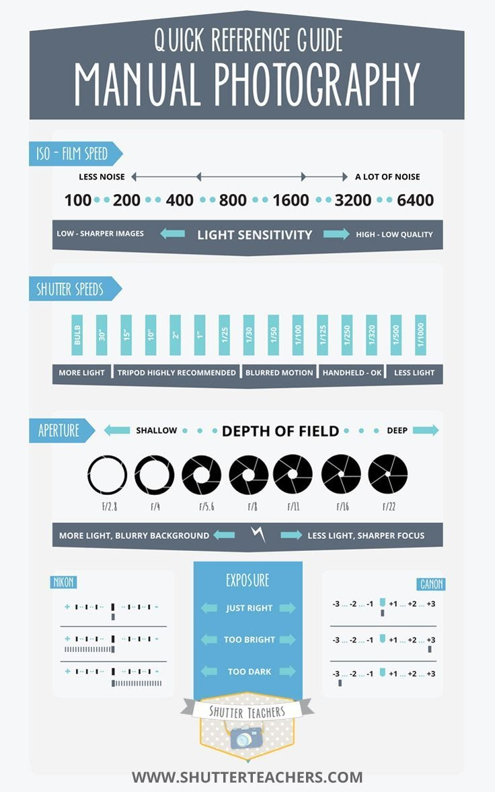

# Bonus Take Home Tips: Apps list, More videos and Key terms
Smartphone Photography Take Info Home Sheet

## Free Camera and Editing Apps: 
- [Adobe Lightroom CC](https://helpx.adobe.com/lightroom-cc/how-to/lightroom-mobile.html){:target="_blank"} 
- [Open Camera](https://opencamera.sourceforge.io/){:target="_blank"} (Android only)
- [Polarr](https://www.polarr.co/){:target="_blank"}
- [RNI Films](https://reallyniceimages.com/store.html){:target="_blank"} (Apple only)
- [Snapseed](https://snapseed.online/){:target="_blank"} 
- [VSCOcam](https://vsco.co/){:target="_blank"}

## Additional photography videos and info:
- [An overview of pro mode on Android phones](https://www.youtube.com/watch?v=DJuQ5Fc7TG0){:target="_blank"} 
<iframe width="560" height="315" src="https://www.youtube.com/embed/DJuQ5Fc7TG0" title="YouTube video player" frameborder="0" allow="accelerometer; autoplay; clipboard-write; encrypted-media; gyroscope; picture-in-picture" allowfullscreen></iframe>
- [How to play around with composition in portraits](https://www.youtube.com/watch?v=bpDRftkteFE){:target="_blank"} 
<iframe width="560" height="315" src="https://www.youtube.com/embed/bpDRftkteFE" title="YouTube video player" frameborder="0" allow="accelerometer; autoplay; clipboard-write; encrypted-media; gyroscope; picture-in-picture" allowfullscreen></iframe>
- [Fun tips and tricks](https://www.youtube.com/watch?v=fTz4Nhgm_SQ){:target="_blank"} 
 <iframe width="560" height="315" src="https://www.youtube.com/embed/fTz4Nhgm_SQ" title="YouTube video player" frameborder="0" allow="accelerometer; autoplay; clipboard-write; encrypted-media; gyroscope; picture-in-picture" allowfullscreen></iframe>
- [Ideas for taking your low light photos to the next level](https://www.youtube.com/watch?v=l9hfE3R9_bc){:target="_blank"} 
<iframe width="560" height="315" src="https://www.youtube.com/embed/l9hfE3R9_bc" title="YouTube video player" frameborder="0" allow="accelerometer; autoplay; clipboard-write; encrypted-media; gyroscope; picture-in-picture" allowfullscreen></iframe>
- [Pro tips for improving your black and white photos](https://youtu.be/XPp6JGClOcE){:target="_blank"} 
<iframe width="560" height="315" src="https://www.youtube.com/embed/XPp6JGClOcE" title="YouTube video player" frameborder="0" allow="accelerometer; autoplay; clipboard-write; encrypted-media; gyroscope; picture-in-picture" allowfullscreen></iframe>
- [How to capture motion and sports photography with your iPhone](https://www.creativelive.com/class/how-to-capture-motion-with-your-iphone-7-or-7-plus-red-bull-photographer-michael-clark)
- 
## If you missed the pre-workshop orientation videos:
- Basics of composition: [“Take better mobile photos using the rule of thirds”](https://www.youtube.com/watch?v=5MjiHl3PHqM){:target="_blank"}
 <iframe width="560" height="315" src="https://www.youtube.com/embed/5MjiHl3PHqM" title="YouTube video player" frameborder="0" allow="accelerometer; autoplay; clipboard-write; encrypted-media; gyroscope; picture-in-picture" allowfullscreen></iframe>
<!-- [How to set focus and exposure](https://www.youtube.com/watch?v=hXYaWoO6q04){:target="_blank"} (this is about iPhones but the concepts apply to all types of smartphones)
<iframe width="560" height="315" src="https://www.youtube.com/embed/hXYaWoO6q04" title="YouTube video player" frameborder="0" allow="accelerometer; autoplay; clipboard-write; encrypted-media; gyroscope; picture-in-picture" allowfullscreen></iframe> -->

## Key Terms:

- **Barrel distortion:** When a lens is curved and distorts the image. 
- **Blown out:** When there is an area of a photograph (usually in a highlight) where there is so much light recorded that there is no detail, just blank white. This cannot be fixed with post-processing.  
- **Colour Temperature:** The visible colour of various types of lighting (e.g., shade light tends to be blue or purple in tone, tungsten light bulbs give off an orange colour, fluorescent lights can make things look green, etc). 
- **Diffused light:** When light shines through something translucent, it is broken down and softened. Examples would be a thin lampshade, a cloud or fog, a thin light curtain/cloth, etc. As the sun gets lower in the sky it shines through atmospheric interference, such as dust, smog, etc, and that diffuses the light and so we get softer light later in the day toward sunset. 
- **Direct light:** Light that is coming directly from the source and hitting your subject. This can be beams of sunlight or artificial light. 
- **Exposure:** How much light the sensor (or film) has been exposed to. This is a change that can be simulated in digital post-processing. 
- **Highlights:** Points of light in the image, usually where light hits or shines. Most important highlights are the ones on your Subject. 
- **Indirect light:** When light bounces off of something and onto your subject, it is called indirect light. Example: Light coming into your home through a window, but not shining with direct rays (where you can see the actual sun) is indirect light. 
- **Post-processing:** Edits made to the image file after it has been captured. 
- **Rule of Thirds:** A guide for composition. Breaking an image into a grid with three horizontal and three vertical lines and placing the subject at one of those intersections, or along one of those lines. 
- **Subject:** The main person or object in your photo. 
- **White balance:** Adjusting the balance of colours in your images so that your neutral whites/greys are correct and not thrown off by light temperature or colour cast. 

[NEXT STEP: Earn a Workshop Badge](informal-credentials.html){: .btn .btn-blue }
