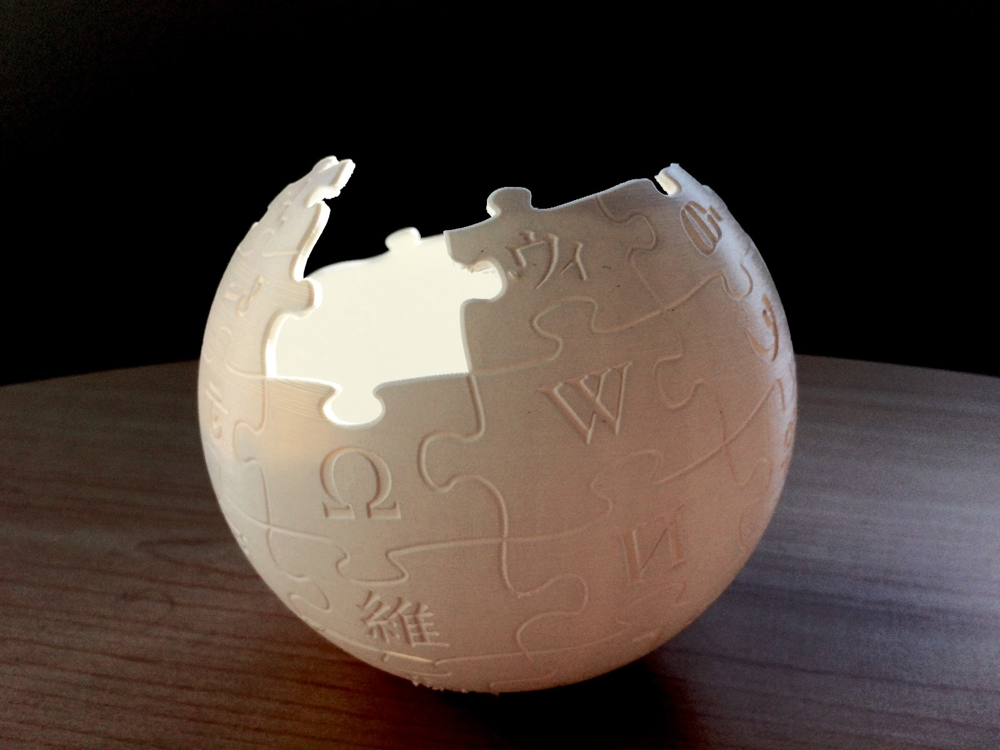

# Move Around and Switch It Up
 
We tend to get stuck in one or two angles when it comes to taking photos. This exercise is to break you out of that to see what a change in perspective can do for a photo.

If you didn't watch the Basics of composition pre-workshop video, and would like additional information about how to take better mobile photos using the rule of thirds, check it out now (7 min): 
<iframe width="560" height="315" src="https://www.youtube.com/embed/5MjiHl3PHqM" title="YouTube video player" frameborder="0" allow="accelerometer; autoplay; clipboard-write; encrypted-media; gyroscope; picture-in-picture" allowfullscreen></iframe>

**Angles in one location & Rule of Thirds:** Find a small object around you (e.g., a toy, coffee cup, small plant). See how many different angles you can take of the object. How do each of those angles change the mood of the photo? Example:  Shot from above, a small toy may look smaller. Taken with the photographer at a lower angle and shooting upwards can create a sense of height or strength. Try moving the subject into different areas of the frame: centred, off to the side (think of the Rule of Thirds vs symmetrical composition that you learned about in the pre-workshop videos). 

**Same object, different background:** Try taking photos of the same object with a few different backgrounds and compare them. How do the backgrounds change the feel of the photo? Can you take a single object and create an emotion from the photo by changing the way it is shot? Example: a photo of a small, colourful toy around other playful things can evoke playfulness, but the same toy taken against a big empty plain white wall can create a sense of loneliness or quiet.

 
**Change the lighting:** If you have some direct sun coming into your space, this will allow you to experiment with direct and indirect lighting. Pick an object and practice taking photos at various angles in and out of the sun. See if you can play with shadows and back-lighting to get different effects. For example: This 3D-printed Wikipedia globe was taken on a table in the shadow below a window, but a ray from the sun was coming through and hit at the perfect angle to cause it to glow inside. 

[NEXT STEP: Post-Processing](post-processing.html){: .btn .btn-blue }
