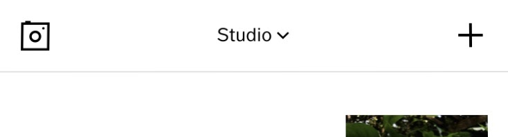
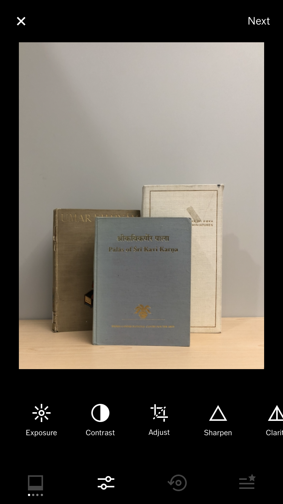
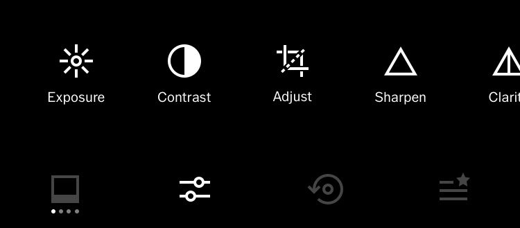
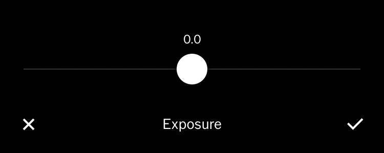
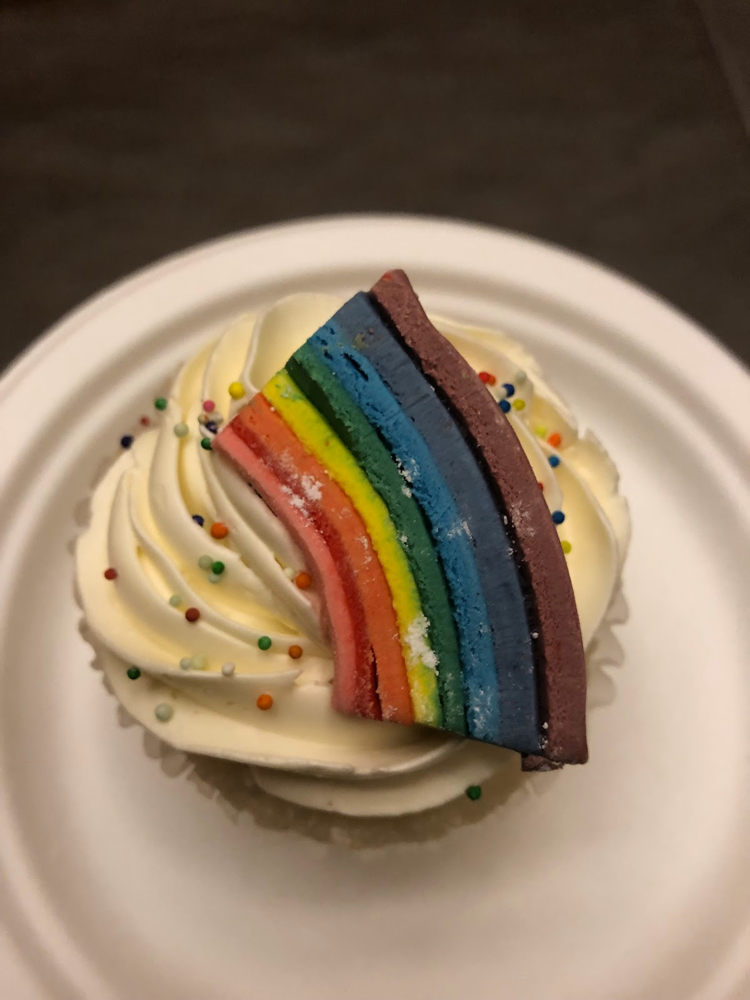
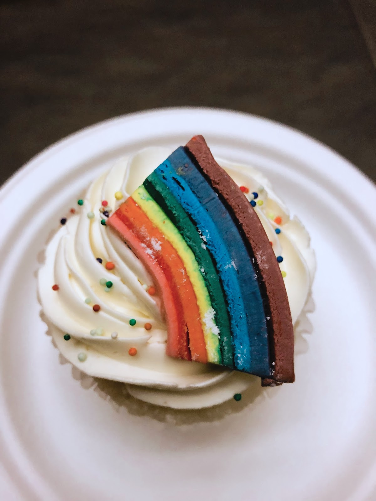
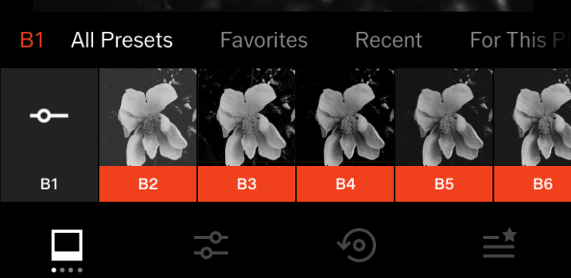

# Post-Processing
When properly exposed, you may find that your photos do not need any editing or post-processing, but some will benefit from a few final touches before sharing them with the world. This activity will take you through the various adjustments (e.g., Exposure, Contrast,  Sharpen, etc.) to practice their effect on an image, as well as some of the preset filters. Even if you move on to other apps (and even for editing photos on a computer) these skills will be transferable. A note of caution: many of these adjustments, when taken too far, can actually damage the final quality of the image. Sharpening, for example. Small adjustments of sharpening can be highly beneficial to the crispness of a photo, but if turned up too high, this adjustment can create distortions and artifacts in the image. This damage may not be noticeable until the image is viewed on a larger screen or printed at full size. However,  edits in VSCOcam are not applied to your original photographs and are saved to a new copy. If you haven’t already, download and install the VSCOcam app from your app store.

## Adjustments:

1. Open VSCOcam and enter **Studio mode**, it should say Studio either at the top (Apple) or bottom (Android) of the app (**tap** on the **centre bottom icon** that looks like two squares, if you aren’t already there). 

2. **Tap** on the plus (**+**) button to add your new image to VSCOcam. 
3. **Tap** to **select the image** and then **tap Import** at the bottom of the screen. The app should say “Import successful” and then should be back in Studio mode with the new image shown. 
 
4. **Double-tap** on the **image** of the books you just took to bring up the image for editing and then **tap** on the **little sliders icon** on the bottom left. This will bring us into a darker screen. 

5. **Tap** on the **sliders (edit) icon** again. In the Adjustments menu, there are many options for fine-tuning your image. The options can get overwhelming. In general, the post-processing changes you want to familiarize yourself with the most are **Exposure, Contrast, Adjust** (See Activity #5 for more details on this tool), and **White Balance**. 

6. Most of the tools are controlled using **sliders**. Once you are happy with the levels, you can tap the checkmark to accept. If you want to cancel the changes, you can **tap** the **X** to go back to the menu.
7. Once you have made an adjustment and moved on to another tool, you can still go back and make changes to previous tools. 
8. Once you are happy with your photo, **tap** on **Next** in the upper right corner. Make sure **Save to Camera** Roll or Gallery is active and then **tap Save**.

## Adjustments Explained: 
**Exposure:** This tool will allow you to increase or decrease the exposure of an image after it has been taken.
**Contrast:** This tool increases or decreases the amount of contrast there is between the light areas and dark areas of an image. High contrast images can look bold, but also if pushed too far can result in a lack of nuance, and details that should be soft may end up looking harsh and rough. On the flip side, a lack of contrast can result in flat images. 
**Adjust:** In VSCOcam, this tool contains three tools: Crop, Straighten, and Skew. This is where you would straighten crooked horizons, crop images, and fix images that have been skewed by barrel distortion. See Activity #5. 
**Sharpen:** This tool gives your images a stronger definition, which helps a soft image look crisper, or sharper. As mentioned above, if turned up too high, this adjustment can create distortions and artifacts in the image. This damage may not be noticeable until the image is viewed on a larger screen or printed at full size. Use sparingly.
**Clarity:** The Clarity tool is very similar to the Contrast tool, but it works in the mid-tones, instead of the light/dark ends of the spectrum. Using this, you will see a difference in texture and details. As with other tools, too much of this tool can have damaging effects on the image. 
**Saturation:** Use this to increase or decrease the level of colour saturation in an image. Turned all the way down will result in a greyscale image and turned all the way up will generally result in an oversaturated, unnatural image. This is a handy tool when the sensor has guessed incorrectly on colours and has either muted them or has overblown them. Use this to bring the colours back to a more natural state. 
**Tone:** VSCOcam has wrapped up two adjustment  tools into one called Tone: Highlights and Shadows. Highlights will adjust the levels of your image highlights and Shadows will adjust the levels of your image shadows.
**White Balance**: Both light temperature and tint are included in this tool. Use Temperature to shift between warm (yellow/orange) and cool (blue), and use Tint to shift between green and magenta tones. This is helpful for correcting light temperatures that are incorrect. For example: tungsten light casting an orange tone onto the plate and cupcake in the photo to the right could be corrected using the Temperature slider. Or sunlight filtering through and bouncing off the green leaves of a tree can create a green cast across the skin of someone’s face would probably be aided using the Tint slider. 
  
**Skin Tone:** This tool is reported to even out or enhance skin tone in portraits, shifting them between a pinker or a golden tone. 
**Vignette:** This tool darkens the corners of the image. 
**Grain:** This creates an effect of analog film grain. 
**Fade:** This fades the image.
**Split Tone:** This allows you to add a coloured tint to the highlights or the shadows of an image. Choose either Shadows or Highlights and then choose a colour. Then drag the slider to select the amount of tint to apply. 
**Borders & HSL:** The other two tools require a paid membership to access: the Borders tool allows you to add borders to your images. The HSL tool allows further colour editing in the Hue, Saturation, and Lightness tools. 

## Presets:

1. In VSCOcam, the app comes with a handful of presets, which are a group of multiple adjustments saved together and named so that they just require one tap to apply.
2. To access these, instead of going into the adjustment tools, you would go through the **Presets menu**, on the bottom left of the screen, which looks like a polaroid photo.
3. Each preset has a name with a letter and number. When you tap on one to select it, there is a slider that appears. **Double-tap** to bring up a full **slider** and **drag** to select the strength of the preset. **Tap** the **checkmark** to accept the changes, or the **X** to **cancel**. You can go into the adjustment tools to make additional changes before exporting. 
4. Once you are happy with your photo, **tap** on **Next** in the upper right corner. Make sure **Save to Camera Roll** or **Gallery is active** and then **tap Save**.

[NEXT STEP: White Balance](white-balance.html){: .btn .btn-blue }
