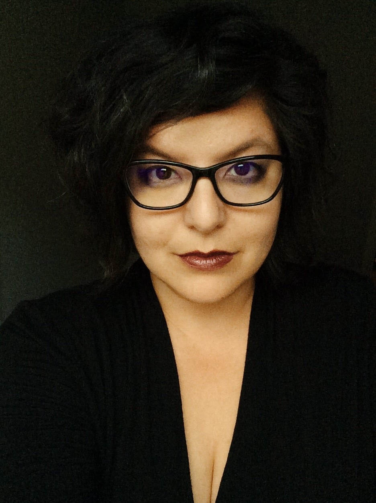
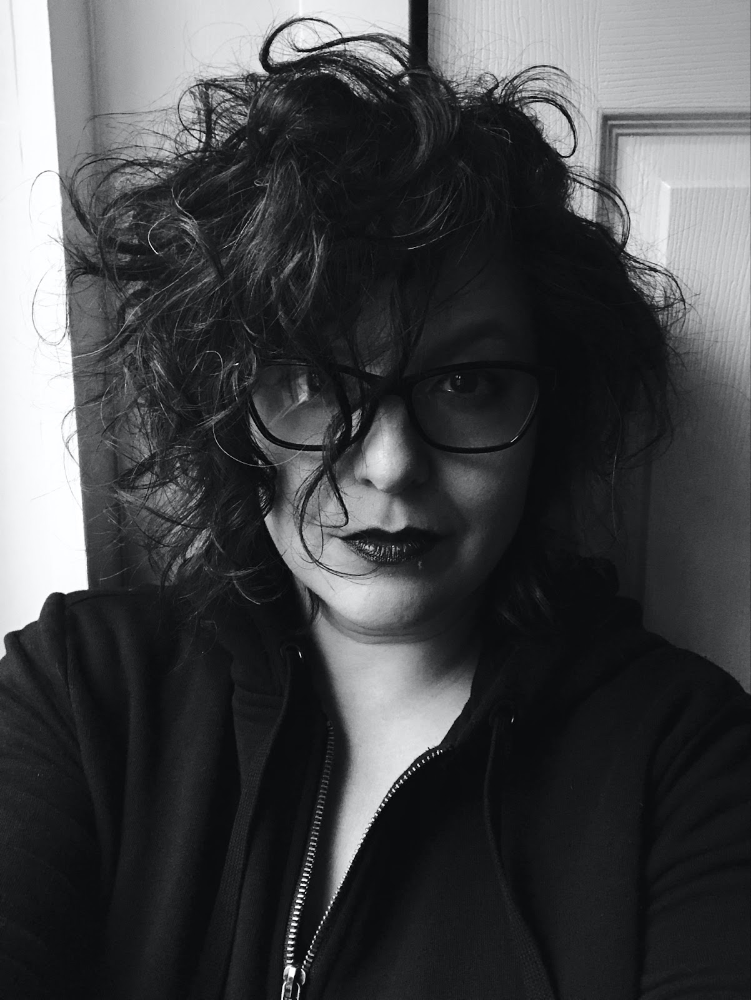
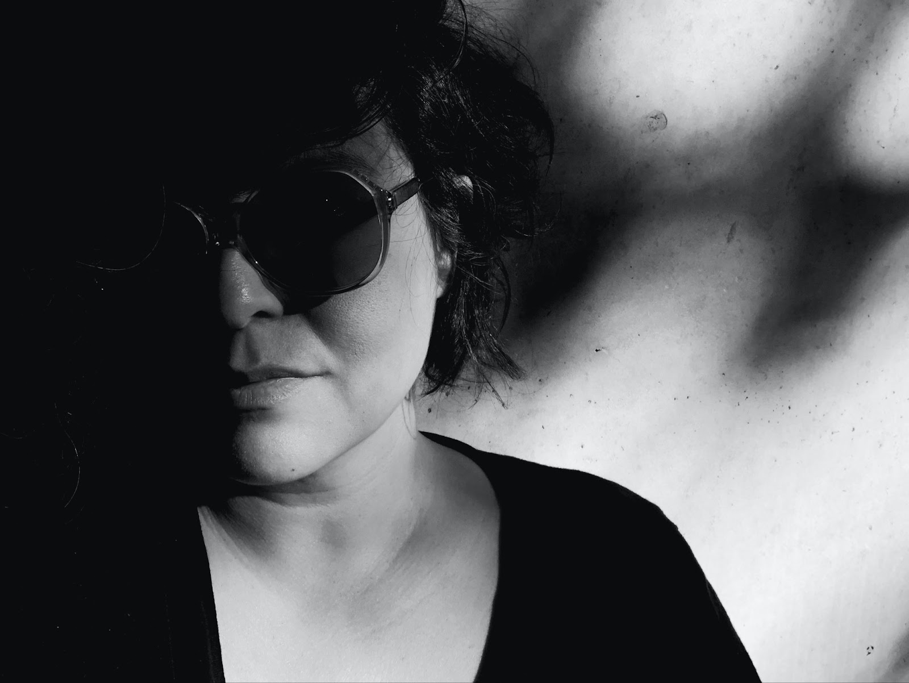

# Self-Portraits
Selfies are fun, but you can use what you’ve learned about lighting and the limitations of your smartphone camera to take higher quality photos and even more dynamic images that go beyond a simple snapshot for fun.

### For the activity:
 

**Part 1: Bad lighting** This part is just to show the contrast of good vs bad lighting. Take a couple of photos by a lamp, under an overhead light bulb, and in front of a window with the light behind you. You will see how the light casts shadows in ways that are either challenging for the smartphone sensor to deal with or are harsh on the face.

**Part 2: Window Light** Now, turn so that you are facing a window with diffused, indirect light. Take a step back if the light is too strong. Tap on your face to focus on it, and use the Exposure slider to adjust if necessary. Note how different the light is by making this small change in where you are standing, and how much better the photo is in comparison. See how the shadows are softer and the skin tones are more natural, even without any post-processing. With a white wall background and some post-processing, you can use this lighting and a smartphone to create a decent headshot of yourself.

**Part 3: Low light** If you take a photo by a window with a darker room behind you, and make sure to drop the exposure so that your face is carefully lit, you can get a dramatic low-key photo. Both of these images were taken by the same window at different times, posed with the light hitting the side of the face or with the light directly hitting the whole face. Exposure was turned down as far as possible with the skin still kept natural. In the second photo, all the furniture and details of the room are dropped into shadow.  

**Notes for another day:**
- Play with shadows to increase drama -- don’t always try to get a perfect representation of your face. What sort of emotion can you express by changing things up from a standard smiling photo? 
- Position your face in more than one spot on the screen, plus vertical vs landscape. How does this change the shape due to barrel distortion? Bonus step later: Try adjusting the barrel distortion using instructions from the bonus activity: Fixing Barrel Distortion (located below:first blue button)
- Go outside and get close with plants or architecture.
- Try setting the timer and stepping back to get more of yourself in the frame.
- Bonus inspiration to take it to another level:[Examples](https://www.myclickmagazine.com/selfies-from-above/){:target="_blank"}

[Bonus Take Home Activity 1: Fixing Barrel Distortion](barrel-distortion.html){: .btn .btn-blue } 
[Bonus Take Home Activity 2: Mini Home Studio](home-studio.html){: .btn .btn-blue } 
[Bonus Take Home Activity 3: App list. More videos and Key terms](more.html){: .btn .btn-blue } 
or 
[NEXT STEP: Earn a Workshop Badge](informal-credentials.html){: .btn .btn-blue }
