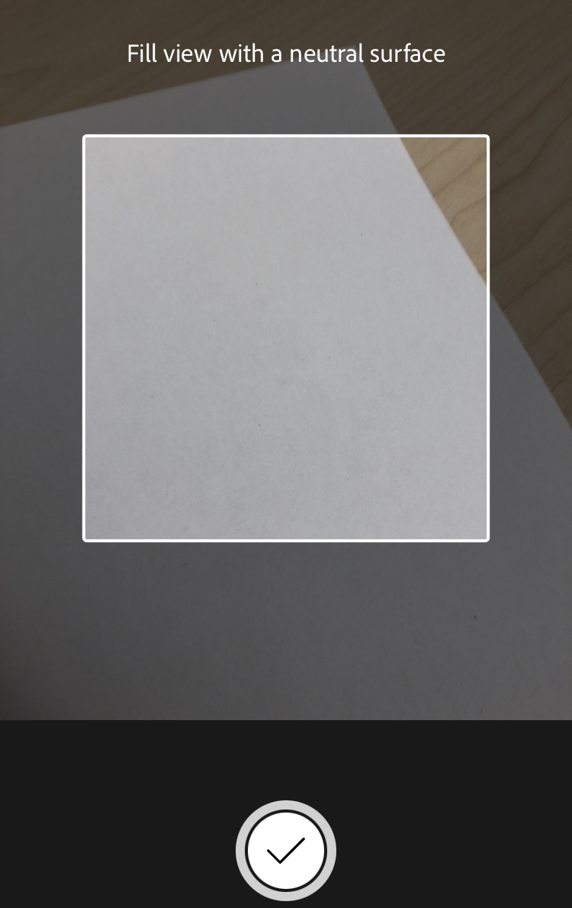

# White Balance

 
In general, it’s more convenient to quickly snap a photo with your default Camera and then post-process the photo in an editing app later on at your leisure. But when light temperature is particularly tricky, sometimes the best option is to take the time to snap the photo right in the app that gives you the most control and get the white balance right when you take the photo, and then post-process after to tweak things to perfection.  

### For the activity:

**Part 1:** Find something that is white (e.g., a plate, piece of paper, etc). Take the photo of the white object in various lighting conditions (natural indirect light from a window, overhead light, lamp light, outside in the shade) and take a photo of it using the default camera on your phone. Note how the color of the white object shifts from actual white in the photo to take on the color temperature of the light it is in. Using either the Lightroom app or the VSCO app, post-process the photo using White Balance, any other settings you find you need, or a preset/filter to finish the photo. Try to keep the scene looking natural while making your edits.

**Part 2:**  Set the white object again in various lighting conditions and take a photo of it using the below instructions for Apple or Android phones, <b>adjusting the white balance live before taking the photo</b>. Try to get the white object as close to white as possible while still keeping the scene looking natural. Pay attention to the surroundings -- do they look too cold/warm? Once the photo is taken, use either the Lightroom app or the VSCO app to make final post-processing adjustments to get an evenly processed photo. Do you find that it is easier to get a photo close to the correct color of the object by adjusting the white balance live while taking the photo, or adjusting it after?

## Apple phones:
In the Lightroom app: 

1. Tap on the camera icon in the bottom right corner to go into Camera mode. This may pop up a permissions box asking if you want to give the app access to your location to tag the data within the photo. This option is up to you.  
2.To the left of the shutter release button, tap on the drop down menu. This should have options for Automatic, Professional, and High Dynamic Range. Select Professional.   

3.Just above the shutter release button is a WB (for White Balance) tap on this to bring up the options: AWB stands for Auto White Balance, the Light Bulb is for Tungsten or Incandescent lighting situations, the thin bar is for Fluorescent lighting situations, the Sun is for direct sunlight or “daylight”, the Cloud icon for cloudy or shade lighting, and the Eyedropper is for setting custom white balance. For instance, on a cloudy day, the colour cast of the light will be cool in tone. So, the white balance setting for Cloudy warms up the tone of the photo to correct this.  
4. Setting up a custom white balance for a shot is often the most reliable method but takes an extra step so is not the fastest. To do this, select the Eyedropper icon in WB. A square will come up. Fill the square with a neutral surface. Something white is typically the easiest, unless you have a true grey card (this is rare as most greys are tinted warm or cool). Then tap the check mark at the bottom. Now your white balance for the area is set and you can take multiple photos in that lighting without having to set up your white balance again.  
5. Aim at the object you want to take a photo of, tap on Exp and drag the slider to the left or right to adjust the Exposure if you need more or less light for this photo. Tap on the object to focus on it. If you want to lock focus and recompose, you can tap and hold.  
6. When satisfied, tap the shutter release button to take the photo.

## Android Phones:
You can use the instructions for Lightroom above or you can opt to explore the settings in your default Android Camera app. If you choose the latter, this will take some experimenting, as each Android phone manufacturer will have different settings and controls. 

You may be able to control this setting directly in your camera by tapping on your Control icon and looking for a WB icon. If a slider comes up, you can drag it back and forth to find the appropriate temperature for the image. Some Android cameras will require you to go into a mode called something like Pro mode, advanced mode, or manual mode to access the WB or white balance controls.

If your phone brings up various set categories of white balance (e.g., a cloud to represent cloudy days and shade, a sun to represent sunny days, etc), you can tap through them to see if any of them come close. Choose the one that is the closest approximation to the white balance of the image you want and you can adjust it further when post-processing the image after you have taken it. 

[NEXT STEP: Self-portraits](self-portraits.html){: .btn .btn-blue }
