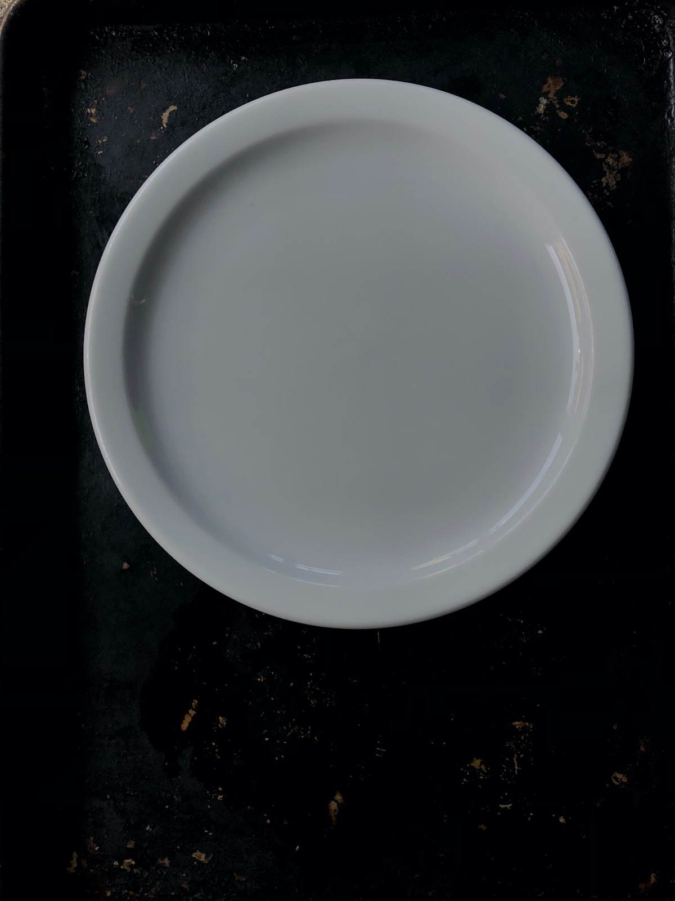
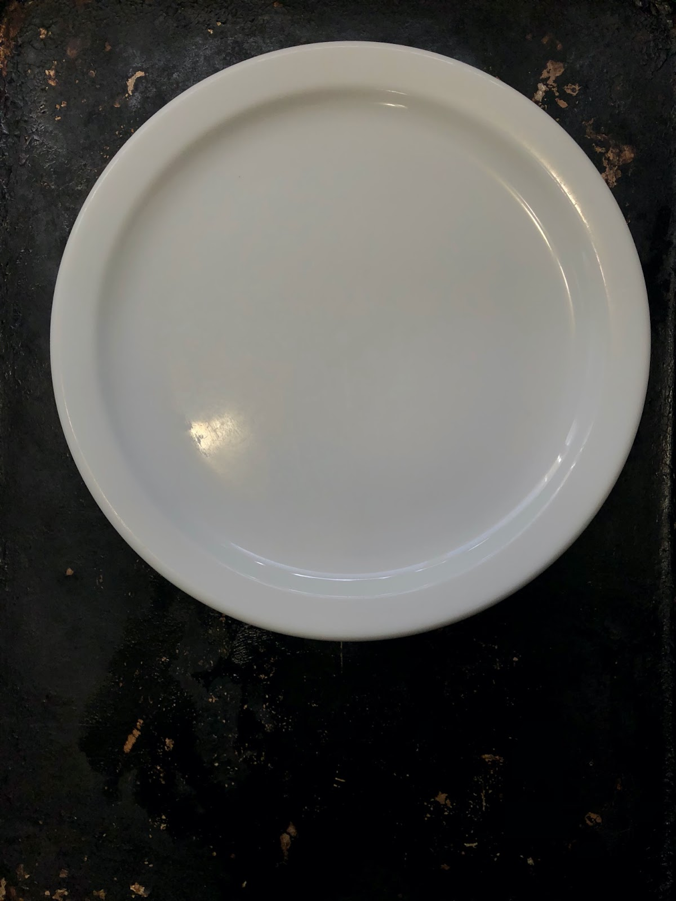

# White Balance

In general, it’s more convenient (and sometimes higher quality, depending) to quickly snap a photo with your default Camera and then post-process the photo in an editing app later on at your leisure. But when light temperature is particularly tricky, sometimes the best option is to take the time to snap the photo right in the app that gives you the most control and get the white balance right when you take the photo, and then post-process after to tweak things to perfection.  

### For the activity:

**Part 1:** Find something that is white (e.g., a plate, piece of paper, etc). Take the photo of the white object in various lighting conditions (natural indirect light from a window, overhead light, lamp light, outside in the shade) and take a photo of it using the default camera on your phone. Note how the color of the white object shifts from actual white in the photo to take on the color temperature of the light it is in. Using the VSCOcam app, post-process the photo using White Balance and any other settings you find you need to finish the photo. Try to keep the scene looking natural while making your edits.

**Part 2:**  Set the white object again in various lighting conditions and take a photo of it using the below instructions for Apple or Android phones, adjusting the white balance live before taking the photo. Try to get the white object as close to white as possible while still keeping the scene looking natural. Pay attention to the surroundings -- do they look too cold/warm? Once the photo is taken, use the VSCOcam app to make final post-processing adjustments to get an evenly processed photo. Do you find that it is easier to get a photo close to the correct color of the object by adjusting the white balance live while taking the photo, or adjusting it after?

## Apple phones:
In the VSCOcam app:
  1. With the app open and in camera mode, first check to see if the exposure is where you’d like it. If not, tap on the Exposure/Brightness icon (sun) and drag the slider up or down to adjust. When satisfied, tap the arrow to get back to the main menu.
  2. When the exposure is set, tap the White Balance icon (circle with WB letters). Drag the slider to the left to bring the white balance or colour temperature to the cool end of the spectrum. Drag the slider to the right to move it to the warmer end of the spectrum. 
  3. When satisfied, tap the shutter release button to take the photo.

## Android Phones:
This will take some experimenting, as each Android phone manufacturer will have different settings and controls. Unfortunately, VSCOcam for Android does not have the White Balance tool, but many Android stock cameras do. 

You may be able to control this setting directly in your camera by tapping on your Control icon and looking for a WB icon. If a slider comes up, you can drag it back and forth to find the appropriate temperature for the image. Some Android cameras will require you to go into a mode called something like Pro mode, advanced mode, or manual mode to access the WB or white balance controls.

If your phone brings up various set categories of white balance (e.g., a cloud to represent cloudy days and shade, a sun to represent sunny days, etc), you can tap through them to see if any of them come close. Choose the one that is the closest approximation to the white balance of the image you want and you can adjust it further when post-processing the image after you have taken it. 

[NEXT STEP: Self-portraits](self-portraits.html){: .btn .btn-blue }
